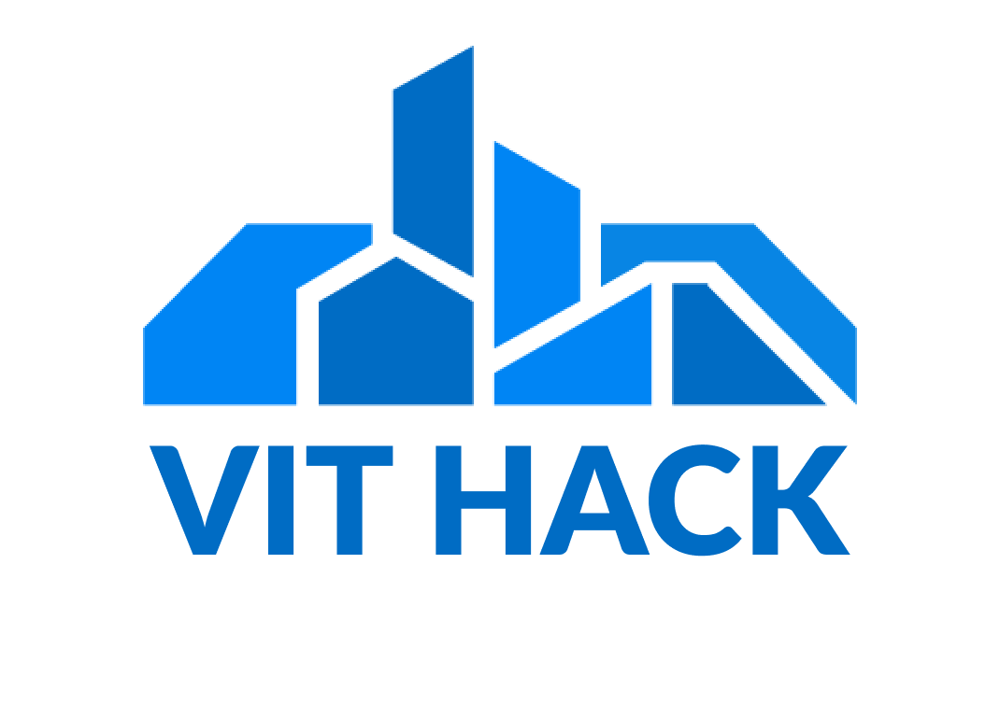
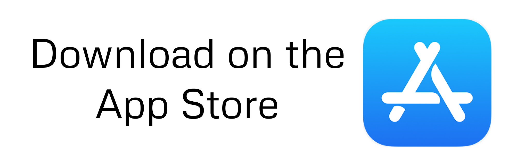

<b> VIT Hack aims to provide an arena for participants to contribute their ideas as solutions to real-world problems. Problem statements will be driven towards social causes to help channelize the participants’ thoughts into a revolutionary solution. VIT Hack focuses on bringing leading industry experts to help ignite innovation.</b>

 
 
 

## App Features:

Timeline

  -> Access the timeline of the event anytime, anywhere and avoid any confusion.
   
  -> Join in livestreams and online sessions.

Collab

    -> Access the list of all the guest speakers and mentors.
     
    -> Preview our collaborators and sponsors.
     
    -> Contact our team.

FAQ

  -> Frequently Asked Questions to help with your instant queries.
       
  -> Browse across queries of all other participants.
       
  -> Share any helpful FAQ to your peers.*

  
Tracks

    -> Quick look at all the available tracks to help you with your choice.
         
    -> Know more about these tracks.
         
    -> Get all the problem statements of your choice of track.

  
Profile

    -> View your profile.
     
    -> View our privacy policy.

### Authors:
| Aaryan | Devang | Garima |
| - | - | - |
| | |  | 

### License 

Copyright (c) 2020 VIT Hack

Licensed under MIT License: https://opensource.org/licenses/MIT

See [LICENSE](https://github.com/pateldevang/Hackgrid/blob/master/LICENSE) for more information
